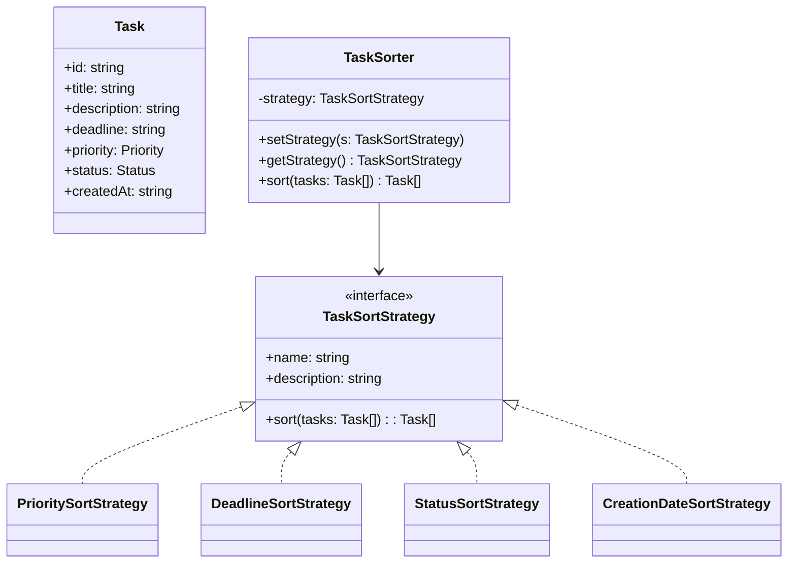
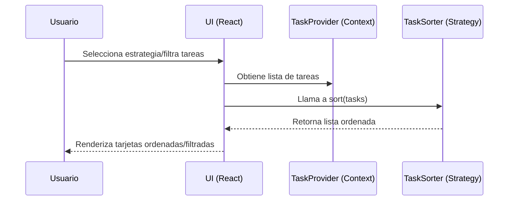

# TaskFlow — Gestión de Tareas con Patrón Strategy (React + Vite + TS + Tailwind)

## 1. Resumen ejecutivo
TaskFlow es una aplicación profesional para gestionar tareas personales y/o de equipo, con foco en priorización, organización flexible y visualización del progreso. La solución aplica una arquitectura por capas (presentación, negocio, datos) y el patrón de diseño Strategy para intercambiar algoritmos de ordenamiento sin afectar a los consumidores. El objetivo es combinar claridad arquitectónica, extensibilidad y una experiencia de usuario moderna.

Beneficios clave:
- Organización flexible: el usuario puede ordenar y filtrar tareas según múltiples criterios.
- Escalabilidad técnica: agregar nuevas estrategias de ordenamiento no impacta el resto del sistema (OCP).
- Experiencia de usuario cuidada: UI limpia, accesible, con tema claro/oscuro y micro-interacciones.

## 2. Objetivos y alcance
- CRUD completo de tareas con validaciones mínimas de negocio (título, descripción, fecha futura, prioridad, estado).
- Priorización y filtros por estado/prioridad, además de búsqueda por texto.
- Estrategias intercambiables de ordenamiento (Strategy): prioridad, fecha límite, estado, fecha de creación.
- Persistencia local mediante `localStorage` (extensible a una API).
- Visualizaciones (KPIs y gráficos) para seguimiento del progreso.

## 3. Contexto de negocio (TaskFlow)
La empresa necesita un sistema para administrar tareas personales y priorizarlas de forma dinámica. El sistema debe permitir:
- Agregar, editar, eliminar tareas.
- Asignar prioridades y estados.
- Filtrar por estado y prioridad y buscar por texto.
- Aplicar diferentes estrategias para organizar las tareas según necesidades.

## 4. Arquitectura en capas (N-tier)
La arquitectura está dividida para separar responsabilidades y facilitar mantenimiento y escalabilidad:

4.1 Capa de presentación (UI)
- Ubicación: `src/app/*`, `src/components/*`.
- Responsabilidad: interacción con el usuario, composición de páginas, componentes visuales (formularios, tarjetas, filtros, modales, gráficos).
- Tecnologías: React, React Router, Tailwind CSS.

4.2 Capa de negocio (Dominio)
- Ubicación: `src/lib/*`.
- Responsabilidad: tipos y contratos (`types.ts`), estado y reglas de negocio (`task-context.tsx`), estrategias de ordenamiento (`strategies.ts`), utilidades de filtrado (`filter-utils.ts`).
- Decisiones clave: uso de Context para gestionar estado y persistir en `localStorage` sin acoplar la UI a detalles de almacenamiento.

4.3 Capa de datos
- Implementación actual: `localStorage` (persistencia en cliente) desde `TaskProvider`.
- Extensibilidad: reemplazable por un repositorio/servicio HTTP manteniendo la interfaz del contexto para no afectar a la UI.

Estructura orientativa del código:
```
src/
  app/               # Páginas y composición de UI
  components/        # Componentes reutilizables (UI, modales, etc.)
  lib/               # Dominio (types, context, strategies, filtros)
```

## 5. Modelo de datos y validaciones
Entidad `Task` (campos mínimos):
- `id: string` (generado en cliente)
- `title: string` (obligatorio, ≥ 3 caracteres)
- `description: string` (obligatorio, ≥ 10 caracteres)
- `deadline: string` (fecha no pasada)
- `priority: "Alta" | "Media" | "Baja"`
- `status: "Pendiente" | "En Progreso" | "Completada"`
- `createdAt: string` (ISO)

Validaciones implementadas en el formulario (`TaskForm`): título, descripción y fecha límite (no pasada).

## 6. Patrón Strategy — Justificación y teoría
Problema: múltiples formas de ordenar tareas (por prioridad, por fecha límite, por estado, por fecha de creación) que pueden crecer con el tiempo. Una solución basada en condicionales se vuelve rígida y difícil de mantener.

Strategy propone:
- Definir una interfaz común para el algoritmo (ordenamiento): `TaskSortStrategy`.
- Implementar variaciones como clases independientes: `PrioritySortStrategy`, `DeadlineSortStrategy`, etc.
- Un contexto que delega el comportamiento a la estrategia actual: `TaskSorter`.

Justificación teórica:
- Principio Abierto/Cerrado (OCP): nuevas estrategias se añaden sin modificar código existente.
- Principio de Responsabilidad Única (SRP): cada estrategia se ocupa de un único criterio.
- Sustitución de Liskov (LSP): se pueden usar diferentes estrategias sin romper el contrato.

Ventajas prácticas:
- Código más legible y testeable.
- Menos condicionales y menor acoplamiento.
- Facilidad para experimentar con nuevos ordenamientos sin tocar la UI.

## 7. Implementación técnica del Strategy
- Interfaz: `TaskSortStrategy` con `sort(tasks: Task[]): Task[]`.
- Estrategias concretas: prioridad, fecha límite, estado, fecha de creación.
- Contexto: `TaskSorter` con `setStrategy`, `getStrategy` y `sort`.
- UI: `StrategySelector` para activar la estrategia; la página de estrategias muestra la lista ordenada.

Referencias de código:
```12:45:src/lib/strategies.ts
export interface TaskSortStrategy {
  name: string
  description: string
  sort(tasks: Task[]): Task[]
}
```
```75:106:src/lib/strategies.ts
export class TaskSorter {
  private strategy: TaskSortStrategy
  constructor(strategy: TaskSortStrategy) { this.strategy = strategy }
  setStrategy(strategy: TaskSortStrategy) { this.strategy = strategy }
  getStrategy(): TaskSortStrategy { return this.strategy }
  sort(tasks: Task[]): Task[] { return this.strategy.sort(tasks) }
}
```

## 8. UML — Diagrama de clases (Strategy)


## 9. UML — Diagrama de componentes (N-tier)
```mermaid
flowchart LR
  UI[Presentación: React + Tailwind]
  Domain[Negocio: Contexto Tareas, Estrategias, Filtros]
  Data[Datos: localStorage\n(persistencia en el navegador)]

  UI --> Domain
  Domain --> Data
```

## 10. Flujo de interacción (secuencia simplificada)


## 11. UX, accesibilidad y estilo visual
- Tipografía Inter para legibilidad profesional.
- Navbar sticky con blur, modales con portal y cierre por ESC/click-outside.
- Tokens de diseño (CSS variables) para colores y estados; soporte dark mode por clase `.dark`.
- Controles con estados de error (form validator), inputs accesibles (labels, aria).

## 12. Organización del código y responsabilidades
- `lib/types.ts`: contratos (Task, Priority, Status) — documentación única de la entidad.
- `lib/task-context.tsx`: orquestación del estado y persistencia — CRUD, toggle, sincronización con `localStorage`.
- `lib/strategies.ts`: algoritmo intercambiable de ordenamiento (Strategy) — cero conocimiento de la UI.
- `lib/filter-utils.ts`: filtrado puro — testable y sin efectos.
- `components/*`: UI reutilizable (formularios, tarjetas, filtros, gráficos, diálogos).
- `app/*`: páginas que componen funcionalidades usando componentes y dominio.

## 13. Tecnologías y versiones
- React 19, React Router DOM 7, TypeScript 5, Vite 7.
- Tailwind CSS 4 con `@tailwindcss/postcss`.
- Recharts (gráficos), Lucide Icons (iconos).

## 14. Instalación y ejecución
Requisitos: Node.js 18+

Instalación de dependencias:
```bash
npm install
```

Desarrollo (HMR):
```bash
npm run dev
```

Build de producción:
```bash
npm run build
```

Previsualización del build:
```bash
npm run preview
```

## 15. Rutas y navegación
- `/` Inicio con KPIs y gráficos.
- `/tareas` CRUD con filtros y tarjetas.
- `/estrategias` Selector de estrategia y lista ordenada.
- `/acerca` Contexto del sistema y beneficios arquitectónicos.

## 16. Extensión futura
- Sustituir `localStorage` por API REST/GraphQL.
- Agregar nuevas estrategias (por ejemplo, ponderación custom, urgencia calculada).
- Tests unitarios para estrategias y para `filterTasks`.
- Manejo de errores y límites (paginación, debounce de búsqueda).

## 17. Solución de problemas
- Pantalla en blanco: revisar consola del navegador (módulos faltantes o hooks fuera de contexto Router).
- Tailwind v4 + PostCSS: asegurarse de tener `@tailwindcss/postcss` en `postcss.config.js`.
- Alias `@`: configurado en Vite y `tsconfig`. Si falla, limpiar caché de Vite.

## 18. Capturas (sugerido)
Agregar imágenes en `public/` y referenciarlas aquí: inicio, tareas, estrategias, modal de edición.


