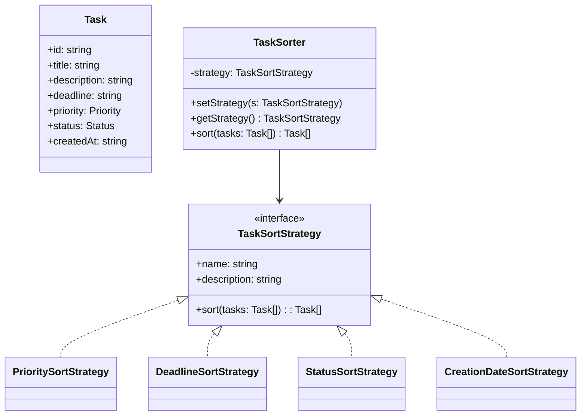
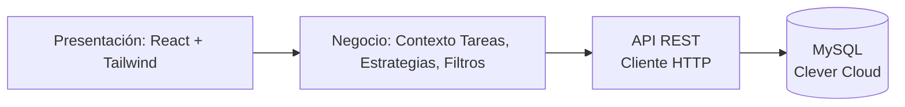
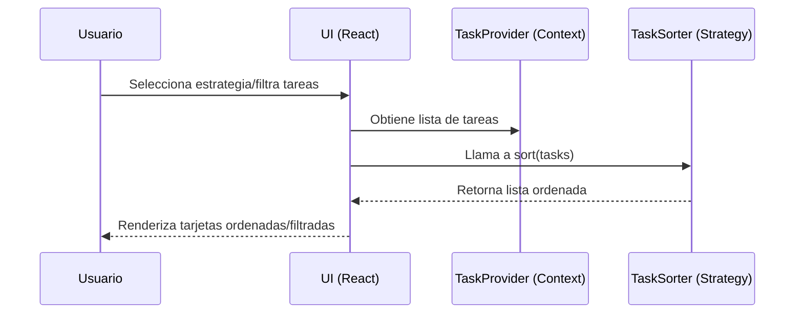

# TaskFlow — Gestión de Tareas con Patrón Strategy (React + Vite + TS + Tailwind)

## 1. Resumen ejecutivo
TaskFlow es una aplicación profesional para gestionar tareas personales y/o de equipo, con foco en priorización, organización flexible y visualización del progreso. La solución aplica una arquitectura por capas (presentación, negocio, datos) y el patrón de diseño Strategy para intercambiar algoritmos de ordenamiento sin afectar a los consumidores. El objetivo es combinar claridad arquitectónica, extensibilidad y una experiencia de usuario moderna.

Beneficios clave:
- Organización flexible: el usuario puede ordenar y filtrar tareas según múltiples criterios.
- Escalabilidad técnica: agregar nuevas estrategias de ordenamiento no impacta el resto del sistema (OCP).
- Experiencia de usuario cuidada: UI limpia, accesible, con tema claro/oscuro y micro-interacciones.

## 2. Objetivos y alcance
- CRUD completo de tareas con validaciones mínimas de negocio (título, descripción, fecha futura, prioridad, estado).
- Priorización y filtros por estado/prioridad, además de búsqueda por texto.
- Estrategias intercambiables de ordenamiento (Strategy): prioridad, fecha límite, estado, fecha de creación.
- Persistencia local mediante `localStorage` (extensible a una API).
- Visualizaciones (KPIs y gráficos) para seguimiento del progreso.

## 3. Contexto de negocio (TaskFlow)
La empresa necesita un sistema para administrar tareas personales y priorizarlas de forma dinámica. El sistema debe permitir:
- Agregar, editar, eliminar tareas.
- Asignar prioridades y estados.
- Filtrar por estado y prioridad y buscar por texto.
- Aplicar diferentes estrategias para organizar las tareas según necesidades.

## 4. Arquitectura en capas (N-tier)
La arquitectura está dividida para separar responsabilidades y facilitar mantenimiento y escalabilidad:

4.1 Capa de presentación (UI)
- Ubicación: `src/app/*`, `src/components/*`.
- Responsabilidad: interacción con el usuario, composición de páginas, componentes visuales (formularios, tarjetas, filtros, modales, gráficos).
- Tecnologías: React, React Router, Tailwind CSS.

4.2 Capa de negocio (Dominio)
- Ubicación: `src/lib/*`.
- Responsabilidad: tipos y contratos (`types.ts`), estado y reglas de negocio (`task-context.tsx`), estrategias de ordenamiento (`strategies.ts`), utilidades de filtrado (`filter-utils.ts`).
- Decisiones clave: uso de Context para gestionar estado y comunicarse con la API sin acoplar la UI a detalles de almacenamiento.

4.3 Capa de datos
- Implementación actual: API REST conectada a base de datos MySQL en Clever Cloud.
- Cliente de API: `src/lib/api.ts` maneja todas las peticiones HTTP (GET, POST, PUT, DELETE).
- Mapeo de datos: conversión entre formato de API y formato interno de la aplicación.
- Persistencia: base de datos MySQL alojada en Clever Cloud, accesible mediante API REST.

Estructura orientativa del código:
```
src/
  app/               # Páginas y composición de UI
  components/        # Componentes reutilizables (UI, modales, etc.)
  lib/               # Dominio (types, context, strategies, filtros)
```

## 5. Modelo de datos y validaciones
Entidad `Task` (campos mínimos):
- `id: string` (generado en cliente)
- `title: string` (obligatorio, ≥ 3 caracteres)
- `description: string` (obligatorio, ≥ 10 caracteres)
- `deadline: string` (fecha no pasada)
- `priority: "Alta" | "Media" | "Baja"`
- `status: "Pendiente" | "En Progreso" | "Completada"`
- `createdAt: string` (ISO)

Validaciones implementadas en el formulario (`TaskForm`): título, descripción y fecha límite (no pasada).

## 6. Patrón Strategy — Justificación y teoría
Problema: múltiples formas de ordenar tareas (por prioridad, por fecha límite, por estado, por fecha de creación) que pueden crecer con el tiempo. Una solución basada en condicionales se vuelve rígida y difícil de mantener.

Strategy propone:
- Definir una interfaz común para el algoritmo (ordenamiento): `TaskSortStrategy`.
- Implementar variaciones como clases independientes: `PrioritySortStrategy`, `DeadlineSortStrategy`, etc.
- Un contexto que delega el comportamiento a la estrategia actual: `TaskSorter`.

Justificación teórica:
- Principio Abierto/Cerrado (OCP): nuevas estrategias se añaden sin modificar código existente.
- Principio de Responsabilidad Única (SRP): cada estrategia se ocupa de un único criterio.
- Sustitución de Liskov (LSP): se pueden usar diferentes estrategias sin romper el contrato.

Ventajas prácticas:
- Código más legible y testeable.
- Menos condicionales y menor acoplamiento.
- Facilidad para experimentar con nuevos ordenamientos sin tocar la UI.

## 7. Implementación técnica del Strategy
- Interfaz: `TaskSortStrategy` con `sort(tasks: Task[]): Task[]`.
- Estrategias concretas: prioridad, fecha límite, estado, fecha de creación.
- Contexto: `TaskSorter` con `setStrategy`, `getStrategy` y `sort`.
- UI: `StrategySelector` para activar la estrategia; la página de estrategias muestra la lista ordenada.

Referencias de código:
```12:45:src/lib/strategies.ts
export interface TaskSortStrategy {
  name: string
  description: string
  sort(tasks: Task[]): Task[]
}
```
```75:106:src/lib/strategies.ts
export class TaskSorter {
  private strategy: TaskSortStrategy
  constructor(strategy: TaskSortStrategy) { this.strategy = strategy }
  setStrategy(strategy: TaskSortStrategy) { this.strategy = strategy }
  getStrategy(): TaskSortStrategy { return this.strategy }
  sort(tasks: Task[]): Task[] { return this.strategy.sort(tasks) }
}
```

## 8. UML — Diagrama de clases (Strategy)


## 9. UML — Diagrama de componentes (N-tier)


## 10. Flujo de interacción (secuencia simplificada)


## 11. UX, accesibilidad y estilo visual
- Tipografía Inter para legibilidad profesional.
- Navbar sticky con blur, modales con portal y cierre por ESC/click-outside.
- Tokens de diseño (CSS variables) para colores y estados; soporte dark mode por clase `.dark`.
- Controles con estados de error (form validator), inputs accesibles (labels, aria).

## 12. Organización del código y responsabilidades
- `lib/types.ts`: contratos (Task, Priority, Status) — documentación única de la entidad.
- `lib/task-context.tsx`: orquestación del estado y persistencia — CRUD, toggle, sincronización con API REST.
- `lib/api.ts`: cliente HTTP para comunicación con el backend — mapeo de datos, manejo de errores, requests asíncronos.
- `lib/strategies.ts`: algoritmo intercambiable de ordenamiento (Strategy) — cero conocimiento de la UI.
- `lib/filter-utils.ts`: filtrado puro — testable y sin efectos.
- `components/*`: UI reutilizable (formularios, tarjetas, filtros, gráficos, diálogos).
- `app/*`: páginas que componen funcionalidades usando componentes y dominio.

## 13. Tecnologías y versiones

### 13.1 Frontend (este repositorio)
- **React 19** - Biblioteca para interfaces de usuario
- **React Router DOM 7** - Enrutamiento del lado del cliente
- **TypeScript 5** - Tipado estático
- **Vite 7** - Build tool y servidor de desarrollo
- **Tailwind CSS 4** - Framework de utilidades CSS
- **Recharts** - Librería de gráficos para React
- **Lucide React** - Iconos modernos

### 13.2 Backend (API)
El backend está en un repositorio separado: [API_TASKFLOW](https://github.com/AdrianXD20/API_TASKFLOW)

**Stack técnico del backend:**
- **Node.js** - Entorno de ejecución
- **Express** - Framework web
- **MySQL** - Base de datos relacional
- **Swagger UI** - Documentación interactiva de la API

### 13.3 Base de datos
- **MySQL** alojada en **Clever Cloud** (servicio gratuito de hosting en la nube)
- Arquitectura de base de datos relacional con tablas normalizadas
- Conexión segura mediante variables de entorno

### 13.4 Infraestructura
- **Frontend**: Desplegado en Vercel/Netlify (o servicio similar)
- **Backend**: Desplegado en Render.com (`https://api-taskflow-iprh.onrender.com`)
- **Base de datos**: Clever Cloud (MySQL)

## 14. Instalación y ejecución

### 14.1 Requisitos previos
- **Node.js 18+** (recomendado LTS)
- **npm** o **yarn** como gestor de paquetes
- **Git** para clonar el repositorio

### 14.2 Clonar el repositorio
```bash
git clone https://github.com/tu-usuario/taskflow-frontend.git
cd taskflow-frontend
```

### 14.3 Instalar dependencias
```bash
npm install
```

Este comando instalará todas las dependencias necesarias:
- React 19 y React Router DOM 7
- TypeScript 5
- Vite 7
- Tailwind CSS 4
- Recharts (gráficos)
- Lucide React (iconos)
- Y otras dependencias de desarrollo

### 14.4 Variables de entorno
El proyecto está configurado para usar la API en producción. En desarrollo, se usa un proxy configurado en `vite.config.ts` que redirige las peticiones a `/api` hacia la API de producción.

Si necesitas cambiar la URL de la API, modifica `src/lib/api.ts`:
```typescript
const API_BASE_URL = import.meta.env.DEV 
  ? "/api"  // Desarrollo: usa proxy
  : "https://api-taskflow-iprh.onrender.com"  // Producción: URL directa
```

### 14.5 Modo desarrollo
```bash
npm run dev
```

Esto inicia el servidor de desarrollo en `http://localhost:5173` con:
- Hot Module Replacement (HMR)
- Recarga automática del navegador
- Proxy configurado para evitar problemas de CORS

### 14.6 Build de producción
```bash
npm run build
```

Genera los archivos optimizados en la carpeta `dist/` listos para desplegar.

### 14.7 Previsualizar build de producción
```bash
npm run preview
```

Sirve localmente la versión de producción para verificar que todo funciona correctamente antes de desplegar.

### 14.8 Linting
```bash
npm run lint
```

Ejecuta ESLint para verificar la calidad del código.

## 15. Rutas y navegación
- `/` Inicio con KPIs y gráficos.
- `/tareas` CRUD con filtros y tarjetas.
- `/estrategias` Selector de estrategia y lista ordenada.
- `/acerca` Contexto del sistema y beneficios arquitectónicos.

## 16. API y documentación

### 16.1 Endpoints de la API
La API está disponible en: `https://api-taskflow-iprh.onrender.com`

**Endpoints principales:**
- `GET /tareas` - Obtener todas las tareas
- `GET /tareas/:id` - Obtener una tarea específica
- `POST /tareas` - Crear una nueva tarea
- `PUT /tareas/:id` - Actualizar una tarea existente
- `DELETE /tareas/:id` - Eliminar una tarea

### 16.2 Documentación con Swagger UI
La API incluye documentación interactiva usando **Swagger UI**. Puedes acceder a la documentación completa en:

```
https://api-taskflow-iprh.onrender.com/api-docs
```

Swagger UI permite:
- Ver todos los endpoints disponibles
- Probar los endpoints directamente desde el navegador
- Ver los esquemas de datos de request y response
- Entender los códigos de estado HTTP y mensajes de error

### 16.3 Formato de datos de la API

**Formato de tarea (API):**
```json
{
  "id": 1,
  "nombre": "Título de la tarea",
  "descripcion": "Descripción detallada",
  "fecha_limite": "2025-12-31",
  "prioridad": "Alta" | "Media" | "Baja",
  "estado": "Pendiente" | "En proceso" | "Completado"
}
```

**Mapeo Frontend ↔ API:**
- `nombre` ↔ `title`
- `descripcion` ↔ `description`
- `fecha_limite` ↔ `deadline`
- `prioridad` ↔ `priority` (igual)
- `estado`: "En proceso" ↔ "En Progreso", "Completado" ↔ "Completada"

### 16.4 Repositorio del backend
El código fuente de la API está disponible en:
- **GitHub**: [AdrianXD20/API_TASKFLOW](https://github.com/AdrianXD20/API_TASKFLOW)

El repositorio incluye:
- Controladores y servicios
- Modelos de datos
- Rutas y middleware
- Configuración de base de datos
- Documentación Swagger

### 16.5 Base de datos MySQL en Clever Cloud

**Clever Cloud** es una plataforma en la nube que ofrece hosting gratuito para bases de datos y aplicaciones.

**Ventajas:**
- Plan gratuito disponible
- Configuración sencilla
- Escalabilidad automática
- Backup automático
- Conexión segura (SSL)

**Configuración:**
La base de datos MySQL está configurada en Clever Cloud y se conecta al backend mediante variables de entorno que contienen:
- Host de la base de datos
- Puerto
- Usuario y contraseña
- Nombre de la base de datos
- String de conexión

## 17. Extensión futura
- Agregar nuevas estrategias (por ejemplo, ponderación custom, urgencia calculada).
- Tests unitarios para estrategias y para `filterTasks`.
- Manejo de errores y límites (paginación, debounce de búsqueda).
- Autenticación y autorización de usuarios.
- Dashboard con métricas avanzadas.

## 18. Solución de problemas

### 18.1 Problemas comunes

**Pantalla en blanco:**
- Revisar la consola del navegador (F12) para ver errores
- Verificar que todos los módulos estén instalados: `npm install`
- Verificar que el servidor de desarrollo esté corriendo: `npm run dev`

**Error de CORS:**
- En desarrollo, el proxy de Vite debería resolver esto automáticamente
- Si persiste, verificar que `vite.config.ts` tenga configurado el proxy correctamente

**Error de Tailwind CSS:**
- Asegurarse de tener `@tailwindcss/postcss` instalado: `npm install -D @tailwindcss/postcss`
- Verificar `postcss.config.js` tiene la configuración correcta
- Limpiar caché: `rm -rf node_modules/.vite`

**Error de alias `@`:**
- Verificar `tsconfig.json` tiene `paths` configurado
- Verificar `vite.config.ts` tiene el alias configurado
- Reiniciar el servidor de desarrollo

**Error al conectar con la API:**
- Verificar que la API esté disponible en: `https://api-taskflow-iprh.onrender.com`
- Verificar que el proxy esté funcionando en desarrollo
- Revisar la consola del navegador para errores de red

**Error al crear/actualizar tareas:**
- Verificar que la API esté respondiendo correctamente
- Revisar los logs en la consola del navegador
- Verificar el formato de los datos enviados

### 18.2 Limpiar y reinstalar
Si tienes problemas persistentes:
```bash
# Limpiar node_modules y reinstalar
rm -rf node_modules package-lock.json
npm install

# Limpiar caché de Vite
rm -rf node_modules/.vite

# Reiniciar servidor
npm run dev
```

## 19. Estructura del proyecto

```
taskflow-frontend/
├── public/              # Archivos estáticos
├── src/
│   ├── app/             # Páginas de la aplicación
│   │   ├── page.tsx     # Página de inicio
│   │   ├── tareas/      # Página de gestión de tareas
│   │   ├── estrategias/ # Página de estrategias
│   │   ├── acerca/      # Página acerca de
│   │   └── globals.css  # Estilos globales
│   ├── components/      # Componentes reutilizables
│   │   ├── ui/          # Componentes UI base
│   │   ├── task-*.tsx   # Componentes de tareas
│   │   └── ...
│   ├── lib/             # Lógica de negocio
│   │   ├── api.ts       # Cliente de API
│   │   ├── types.ts     # Tipos TypeScript
│   │   ├── task-context.tsx  # Context de React
│   │   ├── strategies.ts     # Patrón Strategy
│   │   └── filter-utils.ts   # Utilidades de filtrado
│   ├── main.tsx         # Punto de entrada
│   └── App.tsx          # Componente raíz
├── index.html           # HTML principal
├── vite.config.ts       # Configuración de Vite
├── tailwind.config.js   # Configuración de Tailwind
├── tsconfig.json        # Configuración de TypeScript
└── package.json         # Dependencias del proyecto
```

## 20. Scripts disponibles

```bash
# Desarrollo
npm run dev          # Inicia servidor de desarrollo con HMR

# Producción
npm run build        # Genera build optimizado para producción
npm run preview      # Previsualiza el build de producción

# Calidad de código
npm run lint         # Ejecuta ESLint para verificar código
```

## 21. Contribuir

Las contribuciones son bienvenidas. Para contribuir:

1. Fork el repositorio
2. Crea una rama para tu feature (`git checkout -b feature/AmazingFeature`)
3. Commit tus cambios (`git commit -m 'Add some AmazingFeature'`)
4. Push a la rama (`git push origin feature/AmazingFeature`)
5. Abre un Pull Request

## 22. Licencia

Este proyecto está bajo la Licencia MIT. Ver el archivo `LICENSE` para más detalles.

## 23. Contacto y soporte

- **Repositorio Frontend**: [GitHub - TaskFlow Frontend](https://github.com/tu-usuario/taskflow-frontend)
- **Repositorio Backend**: [GitHub - API_TASKFLOW](https://github.com/AdrianXD20/API_TASKFLOW)
- **API en producción**: `https://api-taskflow-iprh.onrender.com`
- **Documentación API**: `https://api-taskflow-iprh.onrender.com/api-docs`

## 24. Agradecimientos

- **Clever Cloud** por el hosting gratuito de la base de datos MySQL
- **Render.com** por el hosting de la API
- La comunidad de React, TypeScript y Tailwind CSS


